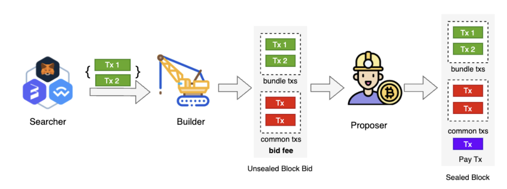

## Go Ethereum

Official Golang execution layer implementation of the Ethereum protocol.

[](https://pkg.go.dev/github.com/ethereum/go-ethereum?tab=doc)
[](https://goreportcard.com/report/github.com/ethereum/go-ethereum)
[](https://travis-ci.com/ethereum/go-ethereum)
[](https://discord.gg/nthXNEv)

Automated builds are available for stable releases and the unstable master branch. Binary
archives are published at https://geth.ethereum.org/downloads/.

## Building the source

For prerequisites and detailed build instructions please read the [Installation Instructions](https://geth.ethereum.org/docs/getting-started/installing-geth).

Building `geth` requires both a Go (version 1.19 or later) and a C compiler. You can install
them using your favourite package manager. Once the dependencies are installed, run

```shell
make geth
```

or, to build the full suite of utilities:

```shell
make all
```

## Executables

The go-ethereum project comes with several wrappers/executables found in the `cmd`
directory.

|  Command   | Description                                                                                                                                                                                                                                                                                                                                                                                                                                                                                                                        |
| :--------: | ---------------------------------------------------------------------------------------------------------------------------------------------------------------------------------------------------------------------------------------------------------------------------------------------------------------------------------------------------------------------------------------------------------------------------------------------------------------------------------------------------------------------------------- |
| **`geth`** | Our main Ethereum CLI client. It is the entry point into the Ethereum network (main-, test- or private net), capable of running as a full node (default), archive node (retaining all historical state) or a light node (retrieving data live). It can be used by other processes as a gateway into the Ethereum network via JSON RPC endpoints exposed on top of HTTP, WebSocket and/or IPC transports. `geth --help` and the [CLI page](https://geth.ethereum.org/docs/fundamentals/command-line-options) for command line options. |
|   `clef`   | Stand-alone signing tool, which can be used as a backend signer for `geth`.                                                                                                                                                                                                                                                                                                                                                                                                                                                        |
|  `devp2p`  | Utilities to interact with nodes on the networking layer, without running a full blockchain.                                                                                                                                                                                                                                                                                                                                                                                                                                       |
|  `abigen`  | Source code generator to convert Ethereum contract definitions into easy-to-use, compile-time type-safe Go packages. It operates on plain [Ethereum contract ABIs](https://docs.soliditylang.org/en/develop/abi-spec.html) with expanded functionality if the contract bytecode is also available. However, it also accepts Solidity source files, making development much more streamlined. Please see our [Native DApps](https://geth.ethereum.org/docs/developers/dapp-developer/native-bindings) page for details.                                  |
| `bootnode` | Stripped down version of our Ethereum client implementation that only takes part in the network node discovery protocol, but does not run any of the higher level application protocols. It can be used as a lightweight bootstrap node to aid in finding peers in private networks.                                                                                                                                                                                                                                               |
|   `evm`    | Developer utility version of the EVM (Ethereum Virtual Machine) that is capable of running bytecode snippets within a configurable environment and execution mode. Its purpose is to allow isolated, fine-grained debugging of EVM opcodes (e.g. `evm --code 60ff60ff --debug run`).                                                                                                                                                                                                                                               |
| `rlpdump`  | Developer utility tool to convert binary RLP ([Recursive Length Prefix](https://ethereum.org/en/developers/docs/data-structures-and-encoding/rlp)) dumps (data encoding used by the Ethereum protocol both network as well as consensus wise) to user-friendlier hierarchical representation (e.g. `rlpdump --hex CE0183FFFFFFC4C304050583616263`).                                                                                                                                                                                |

## Running `geth`

Going through all the possible command line flags is out of scope here (please consult our
[CLI Wiki page](https://geth.ethereum.org/docs/fundamentals/command-line-options)),
but we've enumerated a few common parameter combos to get you up to speed quickly
on how you can run your own `geth` instance.

### Hardware Requirements

Minimum:

* CPU with 2+ cores
* 4GB RAM
* 1TB free storage space to sync the Mainnet
* 8 MBit/sec download Internet service

Recommended:

* Fast CPU with 4+ cores
* 16GB+ RAM
* High-performance SSD with at least 1TB of free space
* 25+ MBit/sec download Internet service

### Full node on the main Ethereum network

By far the most common scenario is people wanting to simply interact with the Ethereum
network: create accounts; transfer funds; deploy and interact with contracts. For this
particular use case, the user doesn't care about years-old historical data, so we can
sync quickly to the current state of the network. To do so:

```shell
$ geth console
```

This command will:
* Start `geth` in snap sync mode (default, can be changed with the `--syncmode` flag),
  causing it to download more data in exchange for avoiding processing the entire history
  of the Ethereum network, which is very CPU intensive.
* Start the built-in interactive [JavaScript console](https://geth.ethereum.org/docs/interacting-with-geth/javascript-console),
  (via the trailing `console` subcommand) through which you can interact using [`web3` methods](https://github.com/ChainSafe/web3.js/blob/0.20.7/DOCUMENTATION.md)
  (note: the `web3` version bundled within `geth` is very old, and not up to date with official docs),
  as well as `geth`'s own [management APIs](https://geth.ethereum.org/docs/interacting-with-geth/rpc).
  This tool is optional and if you leave it out you can always attach it to an already running
  `geth` instance with `geth attach`.

### A Full node on the Görli test network

Transitioning towards developers, if you'd like to play around with creating Ethereum
contracts, you almost certainly would like to do that without any real money involved until
you get the hang of the entire system. In other words, instead of attaching to the main
network, you want to join the **test** network with your node, which is fully equivalent to
the main network, but with play-Ether only.

```shell
$ geth --goerli console
```

The `console` subcommand has the same meaning as above and is equally
useful on the testnet too.

Specifying the `--goerli` flag, however, will reconfigure your `geth` instance a bit:

* Instead of connecting to the main Ethereum network, the client will connect to the Görli
  test network, which uses different P2P bootnodes, different network IDs and genesis
  states.
* Instead of using the default data directory (`~/.ethereum` on Linux for example), `geth`
  will nest itself one level deeper into a `goerli` subfolder (`~/.ethereum/goerli` on
  Linux). Note, on OSX and Linux this also means that attaching to a running testnet node
  requires the use of a custom endpoint since `geth attach` will try to attach to a
  production node endpoint by default, e.g.,
  `geth attach <datadir>/goerli/geth.ipc`. Windows users are not affected by
  this.

*Note: Although some internal protective measures prevent transactions from
crossing over between the main network and test network, you should always
use separate accounts for play and real money. Unless you manually move
accounts, `geth` will by default correctly separate the two networks and will not make any
accounts available between them.*

### Configuration

As an alternative to passing the numerous flags to the `geth` binary, you can also pass a
configuration file via:

```shell
$ geth --config /path/to/your_config.toml
```

To get an idea of how the file should look like you can use the `dumpconfig` subcommand to
export your existing configuration:

```shell
$ geth --your-favourite-flags dumpconfig
```

*Note: This works only with `geth` v1.6.0 and above.*
## Overview

#### Docker quick start
The BSC network has introduced the [Builder API Specification](https://github.com/bnb-chain/BEPs/blob/master/BEPs/BEP322.md) to establish a fair and unified MEV market. Previously, BSC clients lacked native support for validators to integrate with multiple MEV providers at once. The network became unstable because of the many different versions of the client software being used. The latest BSC client adopts the [Proposer-Builder Separation](https://ethereum.org/en/roadmap/pbs/) model. Within this unified framework, several aspects of the BSC network have been improved:

One of the quickest ways to get Ethereum up and running on your machine is by using
Docker:
- Stability: Validators only need to use the official client to seamlessly integrate with various Builders.
- Economy: Builders that can enter without permission promote healthy market competition. Validators can extract more value by integrating with more builders, which benefits delegators as well.
- Transparency: This specification aims to bring transparency to the BSC MEV market, exposing profit distribution among stakeholders to the public.

```shell
docker run -d --name ethereum-node -v /Users/alice/ethereum:/root \
           -p 8545:8545 -p 30303:30303 \
           ethereum/client-go
```
This project represents a minimal implementation of the protocol and is provided as is. We make no guarantees regarding its functionality or security.

This will start `geth` in snap-sync mode with a DB memory allowance of 1GB, as the
above command does.  It will also create a persistent volume in your home directory for
saving your blockchain as well as map the default ports. There is also an `alpine` tag
available for a slim version of the image.
## What is MEV and PBS

Do not forget `--http.addr 0.0.0.0`, if you want to access RPC from other containers
and/or hosts. By default, `geth` binds to the local interface and RPC endpoints are not
accessible from the outside.
MEV, also known as Maximum (or Miner) Extractable Value, can be described as the measure of total value that may be extracted from transaction ordering. Common examples include arbitraging swaps on decentralized exchanges or identifying opportunities to liquidate DeFi positions. Maximizing MEV requires advanced technical expertise and custom software integrated into regular validators. The returns are likely higher with centralized operators.

### Programmatically interfacing `geth` nodes
Proposer-builder separation(PBS) solves this problem by reconfiguring the economics of MEV. Block builders create blocks and submit them to the block proposer, and the block proposer simply chooses the most profitable one, paying a fee to the block builder. This means even if a small group of specialized block builders dominate MEV extraction, the reward still goes to any validator on the network.

As a developer, sooner rather than later you'll want to start interacting with `geth` and the
Ethereum network via your own programs and not manually through the console. To aid
this, `geth` has built-in support for a JSON-RPC based APIs ([standard APIs](https://ethereum.github.io/execution-apis/api-documentation/)
and [`geth` specific APIs](https://geth.ethereum.org/docs/interacting-with-geth/rpc)).
These can be exposed via HTTP, WebSockets and IPC (UNIX sockets on UNIX based
platforms, and named pipes on Windows).
## How it Works on BSC

The IPC interface is enabled by default and exposes all the APIs supported by `geth`,
whereas the HTTP and WS interfaces need to manually be enabled and only expose a
subset of APIs due to security reasons. These can be turned on/off and configured as
you'd expect.


HTTP based JSON-RPC API options:
The figure above illustrates the basic workflow of PBS operating on the BSC network.

* `--http` Enable the HTTP-RPC server
* `--http.addr` HTTP-RPC server listening interface (default: `localhost`)
* `--http.port` HTTP-RPC server listening port (default: `8545`)
* `--http.api` API's offered over the HTTP-RPC interface (default: `eth,net,web3`)
* `--http.corsdomain` Comma separated list of domains from which to accept cross origin requests (browser enforced)
* `--ws` Enable the WS-RPC server
* `--ws.addr` WS-RPC server listening interface (default: `localhost`)
* `--ws.port` WS-RPC server listening port (default: `8546`)
* `--ws.api` API's offered over the WS-RPC interface (default: `eth,net,web3`)
* `--ws.origins` Origins from which to accept WebSocket requests
* `--ipcdisable` Disable the IPC-RPC server
* `--ipcapi` API's offered over the IPC-RPC interface (default: `admin,debug,eth,miner,net,personal,txpool,web3`)
* `--ipcpath` Filename for IPC socket/pipe within the datadir (explicit paths escape it)
- MEV Searchers are independent network participants who detect profitable MEV opportunities and submit their transactions to builders. Transactions from searchers are usually bundled together and included in a block, or none of them will be included.
- The builder collects transactions from various sources to create an unsealed block and offer it to the block proposer. The builder will specify in the request the amount of fees the proposer needs to pay to the builder if this block is adopted. The unsealed block from the builder is also called a block bid as it may request tips.
- The proposer chooses the most profitable block from multiple builders, and pays the fee to the builder by appending a payment transaction at the end of the block.

You'll need to use your own programming environments' capabilities (libraries, tools, etc) to
connect via HTTP, WS or IPC to a `geth` node configured with the above flags and you'll
need to speak [JSON-RPC](https://www.jsonrpc.org/specification) on all transports. You
can reuse the same connection for multiple requests!
A new component called "Sentry" has been introduced to enhance network security and account isolation. It assists proposers in communicating with builders and enables payment processing.

**Note: Please understand the security implications of opening up an HTTP/WS based
transport before doing so! Hackers on the internet are actively trying to subvert
Ethereum nodes with exposed APIs! Further, all browser tabs can access locally
running web servers, so malicious web pages could try to subvert locally available
APIs!**
## What is More

### Operating a private network
The PBS model on BSC differs in several aspects from its implementation on Ethereum. This is primarily due to：

Maintaining your own private network is more involved as a lot of configurations taken for
granted in the official networks need to be manually set up.
1. Different Trust Model. Validators in the BNB Smart Chain are considered more trustworthy, as it requires substantial BNB delegation and must maintain a high reputation. This stands in contrast to Ethereum, where becoming an Ethereum validator is much easier, the barrier to becoming a validator is very low (i.e., 32 ETH).
2. Different Consensus Algorithms. In Ethereum, a block header is transferred from a builder to a validator for signing, allowing the block to be broadcasted to the network without disclosing the transactions to the validator. In contrast, in BSC, creating a valid block header requires executing transactions and system contract calls (such as transferring reward and depositing to the validator set contract), making it impossible for builders to propose the whole block.
3. Different Blocking Time. With a shorter block time of 3 seconds in BSC compared to Ethereum's 12 seconds, designing for time efficiency becomes crucial.

#### Defining the private genesis state
These differences have led to different designs on BSC's PBS regarding payment, interaction, and APIs. For more design philosophy, please refer to [BEP322:Builder API Specification for BNB Smart Chain](https://github.com/bnb-chain/BEPs/blob/master/BEPs/BEP322.md).

First, you'll need to create the genesis state of your networks, which all nodes need to be
aware of and agree upon. This consists of a small JSON file (e.g. call it `genesis.json`):
## Integration Guide for Builder

```json
{
  "config": {
    "chainId": <arbitrary positive integer>,
    "homesteadBlock": 0,
    "eip150Block": 0,
    "eip155Block": 0,
    "eip158Block": 0,
    "byzantiumBlock": 0,
    "constantinopleBlock": 0,
    "petersburgBlock": 0,
    "istanbulBlock": 0,
    "berlinBlock": 0,
    "londonBlock": 0
  },
  "alloc": {},
  "coinbase": "0x0000000000000000000000000000000000000000",
  "difficulty": "0x20000",
  "extraData": "",
  "gasLimit": "0x2fefd8",
  "nonce": "0x0000000000000042",
  "mixhash": "0x0000000000000000000000000000000000000000000000000000000000000000",
  "parentHash": "0x0000000000000000000000000000000000000000000000000000000000000000",
  "timestamp": "0x00"
}
```
The [Builder API Specification](https://github.com/bnb-chain/BEPs/blob/master/BEPs/BEP322.md) defines the standard interface that builders should implement, while the specific implementation is left open to MEV API providers. The BNB Chain community offers a [simple implementation](https://github.com/bnb-chain/bsc-builder) example for reference.

The above fields should be fine for most purposes, although we'd recommend changing
the `nonce` to some random value so you prevent unknown remote nodes from being able
to connect to you. If you'd like to pre-fund some accounts for easier testing, create
the accounts and populate the `alloc` field with their addresses.
### Customize Builder

```json
"alloc": {
  "0x0000000000000000000000000000000000000001": {
    "balance": "111111111"
  },
  "0x0000000000000000000000000000000000000002": {
    "balance": "222222222"
  }
}
```
Although the builder offers great flexibility, there are still some essential standards that must be followed:

With the genesis state defined in the above JSON file, you'll need to initialize **every**
`geth` node with it prior to starting it up to ensure all blockchain parameters are correctly
set:
1. The builder needs to set up a builder account, which is used to sign the block bid and receive fees. The builder can ask for a tip (builder fee) on the block that it sends to the sentry. If the block is finally selected, the builder account will receive the tip.
2. The builder needs to implement the mev_reportIssue API to receive the errors report from validators.
3. In order to prevent transaction leakage, the builder can only send block bids to the in-turn validator.
4. At most 3 block bids are allowed to be sent at the same height from the same builder.

```shell
$ geth init path/to/genesis.json
```
Here are some sentry APIs that may interest a builder:

#### Creating the rendezvous point
1. `mev_bestBidGasFee`. It will return the current most profitable reward that the validator received among all the blocks received from all builders. The reward is calculated as: `gasFee*(1 - commissionRate) - tipToBuilder`. A builder may compare the `bestBidGasFee` with a local one and then decide to send the block bid or not.
2. `mev_params`. It will return the `BidSimulationLeftOver`,`ValidatorCommission`, `GasCeil` and `BidFeeCeil` settings on the validator. If the current time is after `(except block time - BidSimulationLeftOver)`, then there is no need to send block bids anymore; `ValidatorCommission` and `BidFeeCeil` helps the builder to build its fee charge strategy. The `GasCeil` helps a builder know when to stop adding more transactions.

With all nodes that you want to run initialized to the desired genesis state, you'll need to
start a bootstrap node that others can use to find each other in your network and/or over
the internet. The clean way is to configure and run a dedicated bootnode:
Builders have the freedom to define various aspects like pricing models for users, creating intuitive APIs, and define the bundle verification rules.

```shell
$ bootnode --genkey=boot.key
$ bootnode --nodekey=boot.key
```
### Setup with Example Builder

With the bootnode online, it will display an [`enode` URL](https://ethereum.org/en/developers/docs/networking-layer/network-addresses/#enode)
that other nodes can use to connect to it and exchange peer information. Make sure to
replace the displayed IP address information (most probably `[::]`) with your externally
accessible IP to get the actual `enode` URL.
Step 1: Find Validator Information
For validators that open MEV integration, the public information is shown at [bsc-mev-info](https://github.com/bnb-chain/bsc-mev-info). Builders can also provide information here to the validator.

*Note: You could also use a full-fledged `geth` node as a bootnode, but it's the less
recommended way.*
Step 2: Set up Builder.
The builder must sign the bid using an account, such as the etherbase account specified in the config.toml file.

#### Starting up your member nodes
```toml
[Eth.Miner.Mev]
BuilderEnabled = true # open bid sending
BuilderAccount = "0x..." # builder address which signs bid, usually it is the same as etherbase address

With the bootnode operational and externally reachable (you can try
`telnet <ip> <port>` to ensure it's indeed reachable), start every subsequent `geth`
node pointed to the bootnode for peer discovery via the `--bootnodes` flag. It will
probably also be desirable to keep the data directory of your private network separated, so
do also specify a custom `--datadir` flag.
# Configure the validator node list, including the address of the validator and the public URL. The public URL refers to the sentry service.
[[Eth.Miner.Mev.Validators]]
Address = "0x23707D3D71E31e4Cb5B4A9816DfBDCA6455B52B3"
URL = "https://bsc-fuji.io"

```shell
$ geth --datadir=path/to/custom/data/folder --bootnodes=<bootnode-enode-url-from-above>
[[Eth.Miner.Mev.Validators]]
Address = "0x..."
URL = "https://bsc-mathwallet.io"
```

*Note: Since your network will be completely cut off from the main and test networks, you'll
also need to configure a miner to process transactions and create new blocks for you.*

#### Running a private miner


In a private network setting a single CPU miner instance is more than enough for
practical purposes as it can produce a stable stream of blocks at the correct intervals
without needing heavy resources (consider running on a single thread, no need for multiple
ones either). To start a `geth` instance for mining, run it with all your usual flags, extended
by:

```shell
$ geth <usual-flags> --mine --miner.threads=1 --miner.etherbase=0x0000000000000000000000000000000000000000
```

Which will start mining blocks and transactions on a single CPU thread, crediting all
proceedings to the account specified by `--miner.etherbase`. You can further tune the mining
by changing the default gas limit blocks converge to (`--miner.targetgaslimit`) and the price
transactions are accepted at (`--miner.gasprice`).

## Contribution

Thank you for considering helping out with the source code! We welcome contributions
from anyone on the internet, and are grateful for even the smallest of fixes!

If you'd like to contribute to go-ethereum, please fork, fix, commit and send a pull request
for the maintainers to review and merge into the main code base. If you wish to submit
more complex changes though, please check up with the core devs first on [our Discord Server](https://discord.gg/invite/nthXNEv)
to ensure those changes are in line with the general philosophy of the project and/or get
some early feedback which can make both your efforts much lighter as well as our review
and merge procedures quick and simple.

Please make sure your contributions adhere to our coding guidelines:

* Code must adhere to the official Go [formatting](https://golang.org/doc/effective_go.html#formatting)
  guidelines (i.e. uses [gofmt](https://golang.org/cmd/gofmt/)).
* Code must be documented adhering to the official Go [commentary](https://golang.org/doc/effective_go.html#commentary)
  guidelines.
* Pull requests need to be based on and opened against the `master` branch.
* Commit messages should be prefixed with the package(s) they modify.
    * E.g. "eth, rpc: make trace configs optional"

Please see the [Developers' Guide](https://geth.ethereum.org/docs/developers/geth-developer/dev-guide)
for more details on configuring your environment, managing project dependencies, and
testing procedures.

### Contributing to geth.ethereum.org

For contributions to the [go-ethereum website](https://geth.ethereum.org), please checkout and raise pull requests against the `website` branch.
For more detailed instructions please see the `website` branch [README](https://github.com/ethereum/go-ethereum/tree/website#readme) or the
[contributing](https://geth.ethereum.org/docs/developers/geth-developer/contributing) page of the website.

## License

The go-ethereum library (i.e. all code outside of the `cmd` directory) is licensed under the
The bsc library (i.e. all code outside of the `cmd` directory) is licensed under the
[GNU Lesser General Public License v3.0](https://www.gnu.org/licenses/lgpl-3.0.en.html),
also included in our repository in the `COPYING.LESSER` file.

The go-ethereum binaries (i.e. all code inside of the `cmd` directory) are licensed under the
The bsc binaries (i.e. all code inside of the `cmd` directory) is licensed under the
[GNU General Public License v3.0](https://www.gnu.org/licenses/gpl-3.0.en.html), also
included in our repository in the `COPYING` file.

